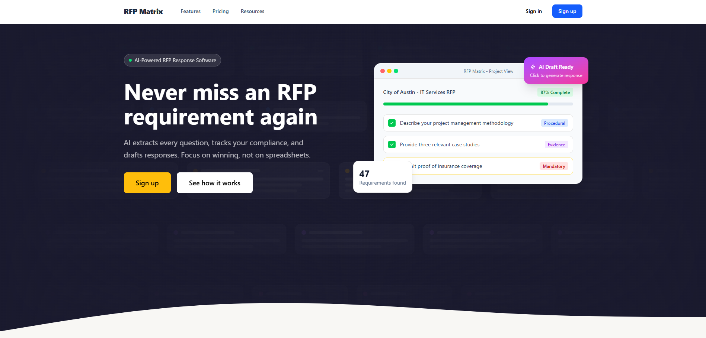
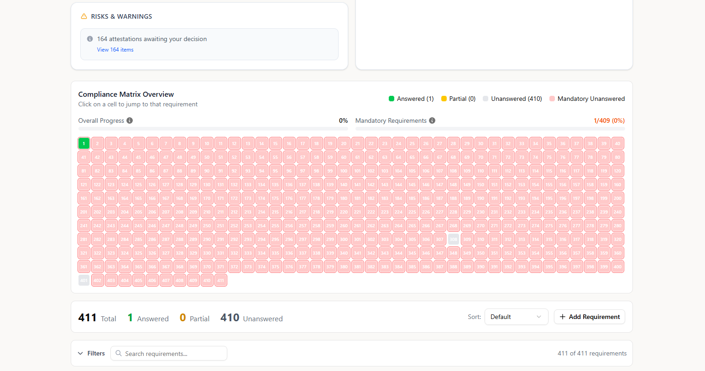
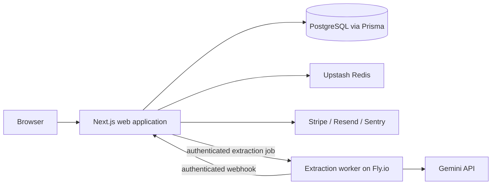

# RFP Matrix

RFP Matrix turns PDF and DOCX tender packs into a structured compliance workflow. It extracts questions and obligations, classifies them, tracks completion, and assists with response drafting and export.

[Live product](https://rfpmatrix.com)



## Product

RFP and tender documents frequently contain hundreds of requirements spread across prose, tables, appendices, and repeated document structure. RFP Matrix gives bid teams one working view of that material instead of requiring them to maintain a parallel spreadsheet.

Core capabilities include:

- PDF and DOCX ingestion
- Requirement and deadline extraction
- Requirement, domain, and response-type classification
- Mandatory-item and attestation tracking
- Searchable compliance matrix with progress and risk views
- AI-assisted drafting with explicit review states
- Reusable response library
- DOCX and PDF export
- Subscription, quota, audit, and account-security flows



## Architecture



The repository contains two deployable services:

- `rfp-engine/` - Next.js application, API routes, persistence, billing, exports, and the compliance workflow
- `extraction-worker/` - long-running document extraction service outside serverless execution limits

Important implementation choices:

- Large extractions run asynchronously outside the web application's serverless request lifecycle.
- Worker requests and callbacks use a shared secret; callback hosts are allowlisted before outbound requests.
- Extraction, classification, compliance state, and drafting are separate stages so users can correct model output without restarting a project.
- Large compliance matrices use virtualised rendering to keep interaction responsive.
- Generated responses remain editable and visibly require human review.

The extraction rules and failure boundaries are documented in [`EXTRACTION-RULES.md`](EXTRACTION-RULES.md).

## Technology

| Area | Technology |
| --- | --- |
| Web | Next.js 16, React 19, TypeScript |
| Data | PostgreSQL, Prisma |
| Extraction | Gemini API, dedicated Express worker |
| Authentication | Auth.js, TOTP two-factor authentication |
| Billing | Stripe |
| Rate limiting | Upstash Redis |
| Email | Resend |
| Monitoring | Sentry, Vercel Analytics and Speed Insights |
| Testing | Vitest, Testing Library, MSW |
| Deployment | Vercel and Fly.io |

## Local Development

Requirements:

- Node.js 20+
- PostgreSQL
- API credentials for the features being exercised

### Web application

```bash
cd rfp-engine
cp .env.example .env.local
npm ci
npx prisma db push
npm run dev
```

The application runs at `http://localhost:3000` by default. See [`rfp-engine/.env.example`](rfp-engine/.env.example) for configuration.

### Extraction worker

```bash
cd extraction-worker
cp .env.example .env
npm ci
npm run dev
```

The worker runs at `http://localhost:3001` by default. See [`extraction-worker/README.md`](extraction-worker/README.md) for its request contract.

## Quality Checks

From `rfp-engine/`:

```bash
npm run lint
npm run typecheck
npm run test:integration
npm run build
```

From `extraction-worker/`:

```bash
npm run typecheck
npm run build
```

## Repository Status

This is an actively developed commercial product. The source is public for technical review and portfolio purposes; no licence to copy, redistribute, or commercially reuse it is granted.
